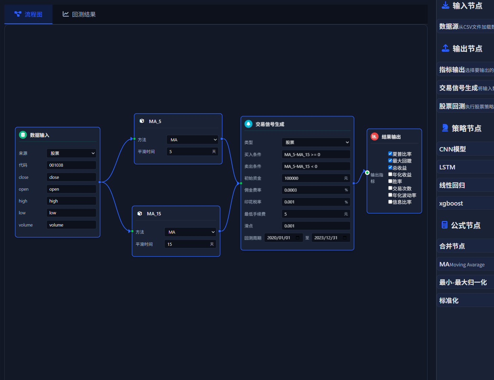

# QuasarX

<div align="center">

**自研量化交易软件**

[Electron](https://www.electronjs.org/) · [Vue 3](https://vuejs.org/) · [C++23](https://isocpp.org/) · [XGBoost](https://xgboost.readthedocs.io/)

</div>

---

## 项目简介

QuasarX 是一款自研量化交易软件（开发中），采用前后端分离架构：

- **QuasarX Client**: Electron 桌面应用，提供策略编辑、交易监控、数据可视化等功能
- **QuantService**: C++ 后端服务，采用数据/事件驱动架构，支持多种券商接口

客户端通过 **REST API** 或 **SSE (Server-Sent Events)** 与服务端实时通信。



## 核心特性

### Client
- 📊 策略流程图可视化编辑（基于 Vue Flow）
- 📈 实时行情监控与数据可视化（ECharts / Plotly）
- 🤖 机器学习策略支持（XGBoost / LSTM / NARX）
- 💼 投资组合管理与风险控制
- 🔌 Element Plus UI 组件库

### Service
- ⚡ 低延迟交易执行引擎
- 📉 支持 CTP / 中泰 XTP / 华鑫等券商 SDK
- 🧠 策略节点图执行引擎
- 🛡️ 风险管理与止损插件
- 📊 特征工程与数据分析（DataFrame 库）
- 🔐 JWT 认证与 OpenSSL 加密

## 技术栈

| Client | Service |
|--------|---------|
| Electron 32.x | C++23 |
| Vue 3.5 + TypeScript | CMake 3.20+ |
| Vite 5.x | Boost / XGBoost |
| Element Plus | NNG (nanomsg) |
| Pinia | OpenSSL |
| Vue Flow | DataFrame (hosseinmoein) |
| ECharts / Plotly | spdlog / fmt |

## 快速开始

### 环境要求

- **Node.js** >= 18.x
- **CMake** >= 3.20
- **C++ 编译器** (支持 C++23)
- **OpenSSL** (安装于 `/usr/local/openssl`)
- **Python 3** (用于测试)

### 构建 Client

```bash
cd app

# 安装依赖
npm install

# 开发模式（热重载）
npm run dev

# 构建生产版本
npm run build
```

### 构建 Service

```bash
cd service

# 创建构建目录
mkdir build && cd build

# 配置 (Release 模式)
cmake .. -DCMAKE_BUILD_TYPE=Release

# 构建
cmake --build . --config Release

# 运行服务
./QuantService config.json
```

> 💡 **提示**: 
> - Debug 模式默认启用 AddressSanitizer: `cmake .. -DENABLE_ASAN=ON`
> - CUDA/TensorRT 支持：`cmake .. -DUSE_CUDA=ON`

### 运行测试

```bash
cd service/build

# 运行所有测试
pytest ../test/testcases/ -v

# 运行单个测试
pytest ../test/testcases/test_order.py::TestOrder::test_stock_order_buy -v
```

## 架构设计

### 系统架构

```
┌─────────────────────────────────────────────────────────────┐
│                    QuasarX Client                           │
│  ┌─────────────┐ ┌─────────────┐ ┌─────────────────────┐   │
│  │ 策略编辑器   │ │ 交易监控    │ │ 数据可视化          │   │
│  │ (Vue Flow)  │ │ (ECharts)   │ │ (Plotly)            │   │
│  └─────────────┘ └─────────────┘ └─────────────────────┘   │
└─────────────────────────────────────────────────────────────┘
                              │
              ┌───────────────┴───────────────┐
              │  REST API / SSE               │
              └───────────────┬───────────────┘
┌─────────────────────────────────────────────────────────────┐
│                    QuantService                             │
│  ┌─────────────┐ ┌─────────────┐ ┌─────────────────────┐   │
│  │ Broker      │ │ Strategy    │ │ Risk                │   │
│  │ SubSystem   │ │ SubSystem   │ │ SubSystem           │   │
│  │ (CTP/XTP)   │ │ (Node Graph)│ │ (Stop-Loss)         │   │
│  └─────────────┘ └─────────────┘ └─────────────────────┘   │
│  ┌─────────────┐ ┌─────────────┐ ┌─────────────────────┐   │
│  │ Portfolio   │ │ Agent       │ │ Feature             │   │
│  │ Subsystem   │ │ SubSystem   │ │ Subsystem           │   │
│  └─────────────┘ └─────────────┘ └─────────────────────┘   │
└─────────────────────────────────────────────────────────────┘
```

### 策略节点类型

策略定义为有向图，支持以下节点类型：

| 节点类型 | 说明 |
|----------|------|
| `Input` / `Quote` | 市场数据输入 |
| `Function` | 技术指标计算 (GARCH 等) |
| `LSTM` / `BOOST` / `NARX` | 机器学习模型推理 |
| `Feature` | 特征工程节点 |
| `Signal` | 交易信号生成 |
| `Execution` | 订单执行 |
| `Portfolio` | 投资组合管理 |
| `Script` | 脚本节点 |

策略图 JSON Schema 详见 [doc/flow.md](doc/flow.md)

### 数据流

```
市场数据 → QuoteNode → 特征计算
       → ML 模型 (XGBoost/LSTM) → 预测
       → 策略节点 → 交易信号
       → 执行节点 → 券商 API → 交易所
```

## REST API

API 文档位于 [doc/restapi.yaml](doc/restapi.yaml) (OpenAPI 3.0)

基础 URL: `http://localhost:19107/v0`

| 端点 | 说明 |
|------|------|
| `/stocks/*` | 股票数据查询 |
| `/future/*` | 期货数据 |
| `/option/*` | 期权数据 |
| `/trade/order` | 订单管理 |
| `/trade/position` | 持仓查询 |
| `/backtest/*` | 回测服务 |

## 配置

服务配置文件 `config.json` 示例：

```json
{
  "broker": {
    "commission": 0.0003,
    "database_path": "./data"
  },
  "exchange": {
    "quote_api": "tcp://quote.example.com:8888",
    "trade_api": "tcp://trade.example.com:8889"
  },
  "server": {
    "port": 19107,
    "jwt_secret": "your-secret-key",
    "credentials": {
      "admin": "hashed-password"
    }
  }
}
```

完整示例见 `service/build/config.json`

## 项目结构

```
QuasarX/
├── app/                     # Electron 客户端
│   ├── electron/            # Electron 主进程
│   ├── src/                 # Vue 源码
│   │   ├── components/      # Vue 组件
│   │   ├── stores/          # Pinia 状态管理
│   │   ├── lib/             # 工具库
│   │   └── ts/              # TypeScript 模块
│   └── package.json
├── service/                 # C++ 服务端
│   ├── src/                 # 源代码
│   ├── include/             # 头文件
│   ├── third_party/         # 第三方库
│   ├── test/                # pytest 测试
│   └── CMakeLists.txt
├── doc/                     # 文档
│   ├── restapi.yaml         # OpenAPI 文档
│   └── flow.md              # 策略图 Schema
└── .github/workflows/       # CI/CD
```

## 开发指南

详见 [QWEN.md](QWEN.md)

## 第三方库

位于 `service/third_party/`:

- [DataFrame](https://github.com/hosseinmoein/DataFrame) - 无头数据分析库
- [fmt](https://fmt.dev/) - 格式化库
- [nng](https://nng.nanomsg.org/) - 消息通信库

## 注意事项

1. **OpenSSL 路径**: 构建时需确保 OpenSSL 安装于 `/usr/local/openssl`
2. **券商 SDK**: CTP/XTP 等券商 SDK 需单独安装
3. **CUDA 支持**: 可选，通过 `-DUSE_CUDA=ON` 启用 TensorRT

## 许可证

MIT License

---

<div align="center">

**QuasarX** - 为量化交易而生

</div>
